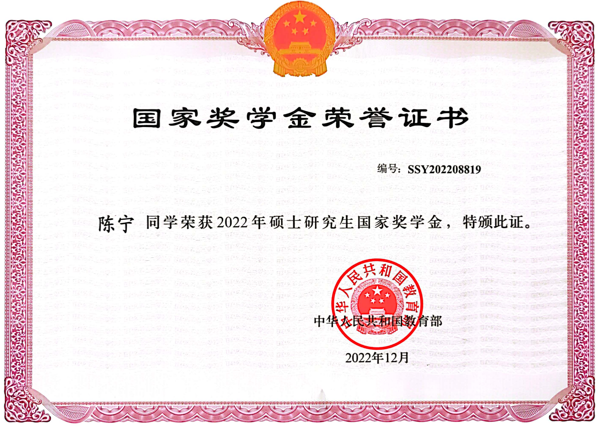

* **National Postgraduate Scholarship** (ID:SSY202208819), 2022-12, Ministry of Education of the People's Republic of China.

* **Second Prize of Shandong Province Postgraduate Innovation Achievement Award** (ID:2022CXCG101), 2022-12-30, Shandong Provincial Department of Education, China.

* **Outstanding Graduates of Shandong Province** (ID:GXYP23YZS10425N428978730-8E94A390E3), 2023-04-17, Human Resources and Social Security Department of Shandong Province, China.

* **One thousand outstanding college students in Qingdao City**, 2023-05, Qingdao Municipal Education Bureau, China.

* **The 17th Top 10 Academic Nominee of Postgraduates**, 2022-11-12, China University of Petroleum (East China), China.

* **Outstanding Master's Thesis of 2023**, 2023-06-20, China University of Petroleum (East China), China.

